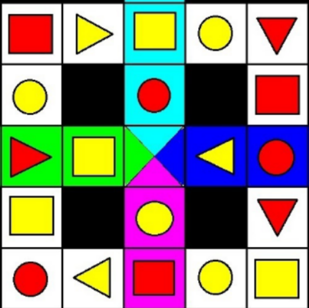

<html>
<body>
<h1> Vision 2.0 </h1>

<h2> Problem Statement </h2>

<h3> Arena Description: </h3>

<ol>
1. There are 2 paths (inner and outer square) and there are 4 connecting paths of different colours joining them.  
2. Bot can change from outer path to inner path or vice versa. Bot is allowed to move in <b> clockwise direction </b> only. The portion of    the arena in <b> black colour </b> is restricted for the movement of the bot.  
3. There will be 3 shapes (square, circle and triangle) of 2 different colours, distinguishing each block in 6 different ways.  
4. On the outermost path there will be 4 arrows at the end of connecting paths pointing in clockwise direction. These arrows mark the <b> Starting Zone </b> where the bot will be placed initially on any one of the arrows.  
5. The Centre of the arena is the home zone.  
6. The bot has to traverse the arena, complete a full round and finish at the home zone.  
</ol>

<h3> Task To-do: </h3>

<ol>
1. The bot is placed at one of the Starting Zones.  
2. An abbreviation which associate to specific colour and shape.  
  <ul>
   - <i> RT </i> for Red Triangle.  
   - <i> RS </i> for Red Square.  
   - <i> RC </i> for Red Circle.  
   - <i> YT </i> for Yellow Triangle.  
   - <i> YS </i> for Yellow Square.  
   - <i> YC </i> for Yellow Circle.  
 </ul>
3. The bot must then find the closest block which it can reach following a clockwise path.  
4. Signal must be sent to when bot stops moving.  
5. As soon as the bot stops moving, bot has to ask for input using the function provided.  
6. This continues till the bot has completed a full round around the center, then it should move to home via the connecting paths that it started on.  
7. On reaching home the bot should signal that it has finished the task.  
</ol>
 
 
<h2> The Approach </h2>
<b> Computer Vision </b> to process images, <b> Breadth-first search </b> to track the path and <b> Pybullet </b> to simulate the bot, are the major things used to complete the task.   
First, a graph is created, in which edges are added in the direction of allowed movement.  
Aruco ---  
Then Breadth-first search is used to determine the path from the current position to the next destination.  
 
</body>
</html>

